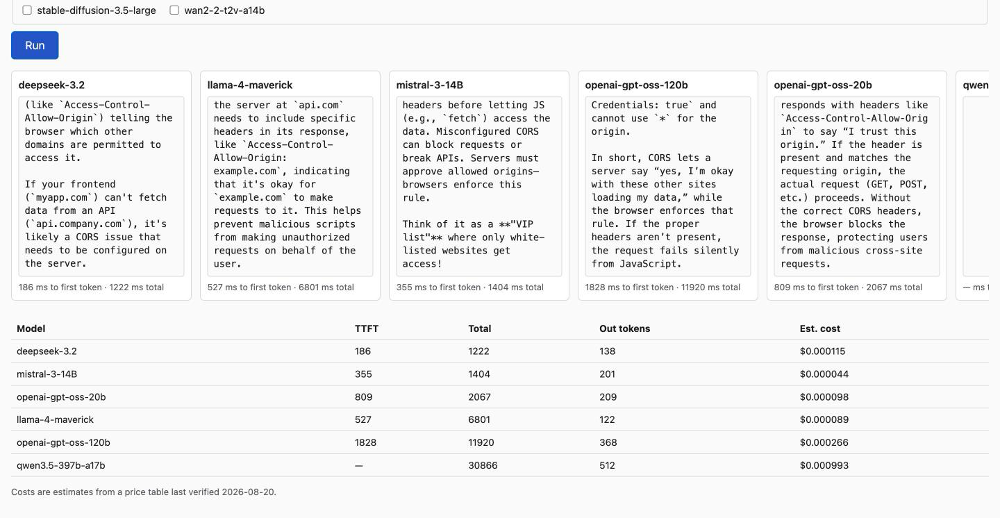

# 🌊 inference-shootout

One prompt, several models, one DigitalOcean endpoint. It sends the same
prompt to every model you pick, streams every response side by side in
real time, and settles into a table of time-to-first-token, total time,
output tokens, and estimated cost — so you can actually see the question
this app exists to answer:

**Which model should I use for this task, and what will it cost me?**

> Part of [**oceanforge**](https://github.com/oceanforge) — small,
> deploy-it-yourself showcase apps for the DigitalOcean cloud.


## Screenshot



`docs/race.gif` shows the same run in motion — six columns filling at
visibly different speeds. Both were captured from a real deployment on
2026-08-26; the numbers in them are real.

## Run it locally

```bash
git clone https://github.com/oceanforge/inference-shootout.git
cd inference-shootout

python -m venv .venv && source .venv/bin/activate
pip install -r requirements.txt

cp .env.example .env   # then fill in your model access key — see below
export $(grep -v '^#' .env | xargs)

python app.py
```

Open http://localhost:8080.

### Getting a model access key

`DIGITAL_OCEAN_MODEL_ACCESS_KEY` is created in the DigitalOcean control
panel under **Gradient AI Platform → Model access keys**.

**This is not the same thing as a DigitalOcean API token.** A DigitalOcean
API token (from **API → Tokens**) authenticates against the DigitalOcean
management API — droplets, apps, DNS, and so on. It will not authenticate
against the inference endpoint this app calls, and passing one in here just
gets you a 401. Model access keys are a separate credential, created in a
separate part of the control panel, scoped specifically to the Gradient AI
Platform's inference endpoint. This mixup is the single most likely thing
to trip up a first run — if `/api/models` comes back empty or erroring,
check which kind of key you generated before anything else.

## Deploy your own

1. Fork this repo.
2. In DigitalOcean, go to **App Platform → Create App** and pick your fork.
3. App Platform detects the Python buildpack automatically — no
   Dockerfile.
4. Add `DIGITAL_OCEAN_MODEL_ACCESS_KEY` as an environment variable, marked
   **encrypted**.
5. Click **Deploy**.

Prefer config-as-code? An app spec is included at
[`.do/app.yaml`](.do/app.yaml). It pins `instance_count: 1` on purpose —
see the comment in that file for why (short version: the spend guards are
in-memory and per-process, so more instances means a higher real ceiling,
not a shared one).

## How it works

The entire DigitalOcean-specific surface area is two lines — an OpenAI
client pointed at a different `base_url`:

```python
client = OpenAI(
    base_url="https://inference.do-ai.run/v1/",
    api_key=key,  # from DIGITAL_OCEAN_MODEL_ACCESS_KEY — see inference.py::make_client
)
```

Everything else is the standard `openai` SDK. That's the whole argument
this app exists to make: comparing Claude against GPT against an
open-weight model costs one API key, one base URL, and no
provider-specific code.

**SSE fan-out.** The page opens one `EventSource` per selected model,
concurrently, each hitting its own `GET /stream?model=...&prompt=...`
connection. Each connection runs its own `stream=True` completion and
emits `start` / `token` / `done` / `error` events independently. There is
no server-side merging — one model erroring or hanging cannot affect the
others, and there's no async orchestration or event loop to get wrong.

**Threaded workers, not sync.** That fan-out means a single page load opens
N concurrent long-lived connections to the server. Gunicorn's default sync
worker holds exactly one connection per worker, so under a handful of
simultaneous SSE streams it will exhaust the worker pool and the page will
appear to hang. The `Procfile` uses threaded workers instead:

```
web: gunicorn --worker-class gthread --threads 16 --timeout 120 --bind 0.0.0.0:8080 'app:create_app()'
```

Note the `'app:create_app()'` target, not `app:app`: `app.py` deliberately
has no module-level Flask instance, so that a missing
`DIGITAL_OCEAN_MODEL_ACCESS_KEY` raises a clear error explaining the
model-access-key-vs-API-token distinction above, instead of gunicorn's
opaque "Failed to find application object" when it can't build one at
import time.

## Is there a hosted demo?

No, deliberately. One ran long enough to take the measurements in
`NOTES.md` and capture the screenshot, then it was torn down.

A shared demo answers the wrong question. It tells you how six models
handled *someone else's* prompt on *someone else's* account tier. The
question worth answering is which model suits **your** task at **your**
prices, and that needs your key and your prompt. It takes about two
minutes — see **Run it locally** above.

The spend guards below exist for anyone who does host it publicly.

`RATE_LIMIT_PER_MINUTE` is counted in **races per IP per minute, not
requests**. One race opens one `/stream` request per selected model, so
the default `RATE_LIMIT_PER_MINUTE=3` with `MAX_MODELS_PER_RUN=6` is an
allowance of 18 requests a minute — three full six-model races. Setting it
to `0` disables the limiter, which is usually what you want when you are
running this on your own key.

## The write-up

[`docs/blog-post.md`](docs/blog-post.md) is the full story: what the
measurements showed, why the concurrency prediction was wrong, and the
three things that caught me out. `NOTES.md` is the raw build log it was
written from, and `docs/measurements.json` has all 54 runs.

Short version: the cheapest model was also the fastest, and nine of the 54
calls returned no text at all while billing in full.

## License and disclosure

[MIT](LICENSE). Built as an [**oceanforge**](https://github.com/oceanforge)
showcase app. **oceanforge is not affiliated with, endorsed by, or
sponsored by DigitalOcean** — this is an independent project that happens
to demonstrate a DigitalOcean product.
